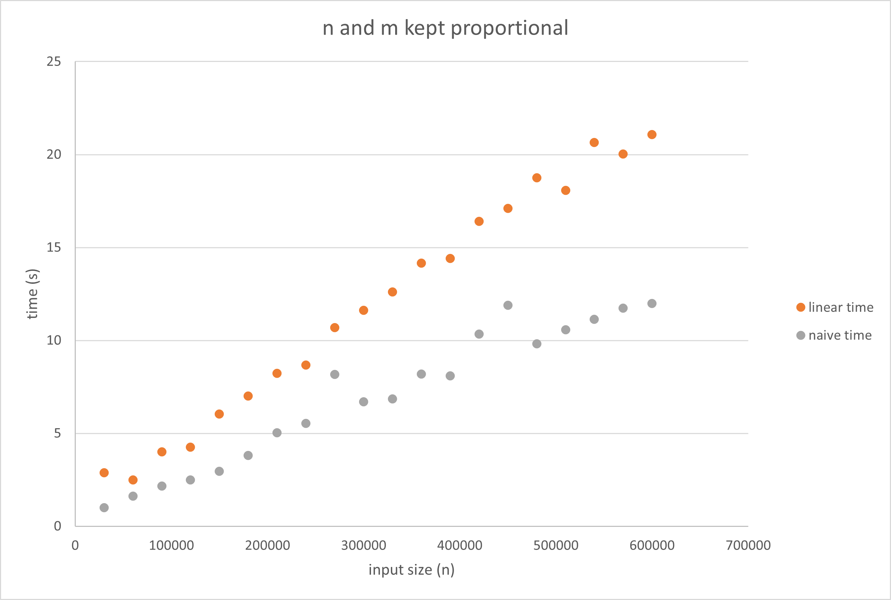

[](https://classroom.github.com/online_ide?assignment_repo_id=8618182&assignment_repo_type=AssignmentRepo)
# Basic exact pattern matching

This project is about exact pattern matching. You should implement the naive quadratic time algorithm and a linear time algorithm of your cheice, e.g. the border-array or the KMP-algorithm. The naive algorithm has the worst-case running time O(nm) and the other algorithms we have seen have worst-case running time O(n+m).

The algorithms should be implemented in two programs, `naive` and `lin`. Both programs should take two arguments (no more and no less): the first should be a Simple-FASTA file and the second a Simple-FASTQ file. The programs should output all matches in the Simple-SAM format to stdout (i.e., they should write to the terminal). Since we are only doing exact matching, the CIGAR strings in the output should consist of M’s only, since all the characters in the read will match the reference at the reported position.

For example, with this Simple-FASTA file

```
> chr1
mississippi
> chr2
mississippimississippi
```

and this Simple-FASTQ file

```
@read1
iss
@read2
mis
@read3
ssi
@read4
ssippi
```

your output should be

```
read1	chr1	2	3M	iss
read1	chr1	5	3M	iss
read1	chr2	2	3M	iss
read1	chr2	5	3M	iss
read1	chr2	13	3M	iss
read1	chr2	16	3M	iss
read2	chr1	1	3M	mis
read2	chr2	1	3M	mis
read2	chr2	12	3M	mis
read3	chr1	3	3M	ssi
read3	chr1	6	3M	ssi
read3	chr2	3	3M	ssi
read3	chr2	6	3M	ssi
read3	chr2	14	3M	ssi
read3	chr2	17	3M	ssi
read4	chr1	6	6M	ssippi
read4	chr2	6	6M	ssippi
read4	chr2	17	6M	ssippi
```

assuming you iterate over reads in an outer loop and FASTA records in an inner loop. If you order your loops differently, of course, the output will be different.

The project should be in groups of 2–3 students. It will not be graded.

## Part 1: parsers 

Write parsers for Simple-FASTA and Simple-FASTQ if you have not done so already.

## Part 2: simulating data for evaluation

For testing the running time as functions of n and m, you should also write code for generating Simple-FASTA and Simple-FASTQ files (with appropriate properties for your tests).

## Part 2: mappers

Now write the tools for exact pattern matching. You can use the naive algorithm to test your linear time algorithm; the result of the two programs that you write should be identical after you sort the output.

```sh
> ./naive fasta.fa fastq.fq | sort > naive.sam
> ./lin fasta.fa fastq.fq | sort > lin.sam
> diff naive.sam lin.sam
```

You might not have to sort the output, if you run through reads

## Evaluation

Implement the two algorithms in two tools, `naive` and `lin`, that must be present at the root of the repository once they are built. The test setup checks that they give the correct output on selected data, but you should still carefully test them.

Once you have implemented the tools, fill out the report below. 

## Report

For the linear algorithm we implimented KMP.

### Insights you may have had while implementing and comparing the algorithms. 

Implementing the naive search with build-in function in Python that are implemented in C makes hard to directly compare running times at the tested input sizes. Furthermore, it seems like there is some acceleration of the algorithms as it runs. While the cause of this largely eludes us, we guess that the hardware/firmware is capable optimizing repeated operations.

### Problems encountered if any. 

Indexing is a nightmare as usual. KMP should be easy but somehow isn't.
Johan's Git syncronization did not work at all. But now it is fixed, so hopefully you can also see his TA from now on.

### Experiments that verifies the correctness of your implementations.

We validated lin.py by comparing result to the naive (naive.py) implementation on randomly generated data created with the functions in "data_gen.py" with different patterns/properties. Below is a short description of each piece of simulated data. We either generate alphabets of a random lengths up to 50 with the function make_alphabet() or use the DNA alphabet (ATCG). For functions that need weights make_random_weights() create random weights for the alphabets. For the DNA test we predefined weights.

Below 
"random"=="pseudo-random" -> True

one_letter():
Simply same repeating single letter from alphabet. Letter is randomly sampled from alphabet.

tot_rand():
Completely random sampling from alphabet.

prob_rand(): 
Random sampling from alphabet but with weighted probability for each letter in alphabet.

repeat_rand():
Completely random repeat of given length. Last repeat is truncated to fit desired length.

repeat_rand_palindrome():
Same af above but makes palindromic repeats. Last repeat is truncated to fit desired length.

DNA_markov():
Generates a DNA sequence using a markov chain with equal change for each stating base and then 70% chance of repeating A and T, 55% chance of repeating C and G and equal remaining probability to change to another letter (10 or 15%).

### Experiments validating the running time.

For this section, you should address the following:

* An experiment that verifies that your implementation of `naive` uses no more time than O(nm) to find all occurrences of a given pattern in a text. Remember to explain your choice of test data. What are “best” and “worst” case inputs? 

* An experiment that verifies that your implementations of `lin` use no more time than O(n+m) to find all occurrences of a given pattern in a text. Remember to explain your choice of test data. What are “best” and “worst” case inputs?

For testing the timing of of both algorithms we used the python package 'timeit'. We time only the execution of the function calls with given input. For each input the function is called 10 times, which is the time reported in the graphs below.

We ran the functions with a completely random DNA string as input.

The best case input for the naive algorithm is a string not containing the first letter in the search pattern. Worst possible case is a single letter repeat with a pattern also only consisting of that letter. Here it will have to go through each letter in the pattern for each position in the sequence.
For the linear time algorithm we implimented KMP. Worst case is O(n+m) where the border array only contains 0's (there are no borders at all). Best case is exact repeats of search pattern, where the border array will allow biggest possible jumps.

We assesed runtimes for the two algorithms with a set of DNA_markov()-generated sequences (this.fasta) and patterns generated with repeat_rand(rep_length=10). Below are the datapoints for the timings. Pattern length rises proportionally with sequence length starting at 3.


